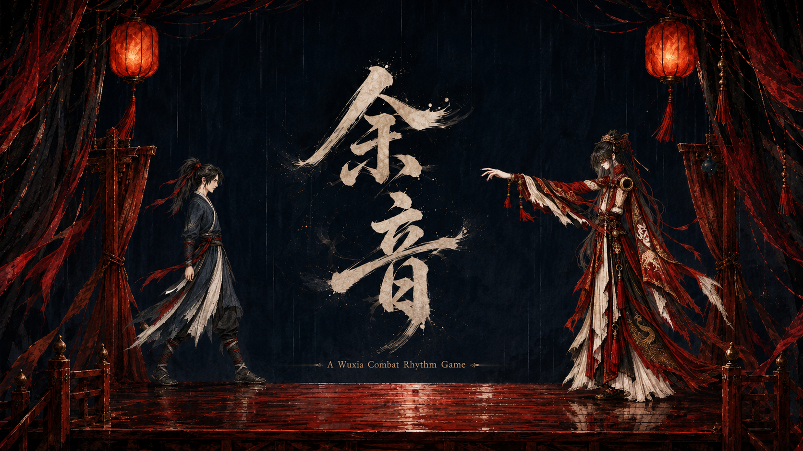

<p align="center">
  
</p>

<p align="center">
  <h1 align="center">余音 · Yuyin</h1>
  <p align="center">
    古风江湖的节奏战斗游戏Prototype
    <br />
    <em>A guofeng wuxia rhythm-combat game</em>
  </p>
</p>

<p align="center">
  
  
  
  
</p>

---
## 目录

```
design/gdd/game-concept.md      游戏概念文档（含竞品分析）
design/narrative/               主题曲歌词与曲式映射
prototypes/rhythm-feel/         Godot 原型 + 完整开发记录
  ├── README.md                 ← 所有验证结论都在这里
  ├── ASSETS.md                 美术素材规格与 AI 生成 prompt
  └── rhythm-feel/              Godot 项目本体
tools/                          音频分析、曲目地图、包络导出、音效合成
docs/engine-reference/godot/    Godot 4.7 版本参考（含节奏同步专用模块）
```

## 致谢

本项目的开发流程使用了
**[Claude Code Game Studios](https://github.com/Donchitos/Claude-Code-Game-Studios)**
（MIT）提供的 Claude Code 技能与代理框架——从 `/brainstorm` 构思、`/setup-engine`
配置引擎，到 `/prototype` 的原型阶段规范，都走的它的工作流。仓库里的
`.claude/` 目录来自该项目。

音乐《牵丝戏》原唱：银临 / Aki 阿杰。仅在本地原型中用于手感验证，未随仓库分发。

## License

MIT
